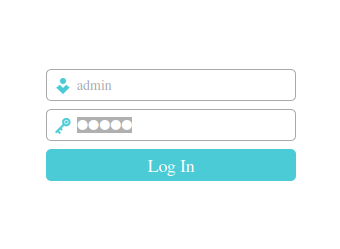
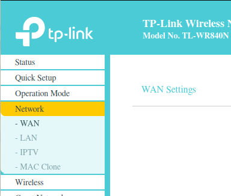
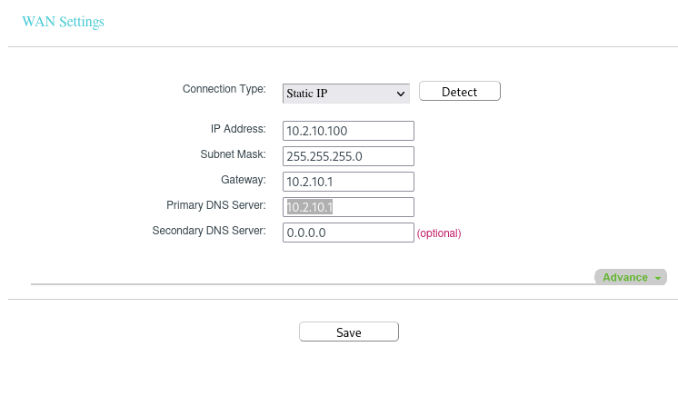

# Panduan Mengubah Pengaturan WAN dari PPPoE ke IP Static: Router TP-Link WR840N

## Sebelum Memulai: Informasi Penting

Sebelum Anda memulai proses pengaturan, pastikan Anda memiliki informasi berikut:
- Alamat IP default router TP-Link WR840N: Biasanya 192.168.0.1 atau 192.168.1.1
- Kata sandi WiFi 

    | Password Wifi                |
    |--------------------------|
    | 12345678  |
    | 87654321  |
    | 1234567890  |
    | 0987654321  |
    | 0123456789  |

- login router

    | Username                | Password          |
    |--------------------------|----------------|
    | admin  | admin          |
    | admin  | admin12345          |
    | admin  | admin123          |

- Informasi IP Static yang akan Anda gunakan: Alamat IP, Subnet Mask, Gateway, DNS

## Langkah 1: Masuk ke Antarmuka Router

1. Buka peramban web di komputer atau perangkat yang terhubung ke router.
2. Masukkan alamat IP default router (misalnya, 192.168.0.1) di bilah alamat peramban.
3. Tekan Enter. Anda akan diarahkan ke halaman login router.
4. Masukkan nama pengguna dan kata sandi default router (biasanya admin untuk keduanya).
5. Tekan Login untuk masuk ke antarmuka router.

## Langkah 2: Navigasi ke Pengaturan WAN

1. Di antarmuka router, cari menu atau opsi yang berkaitan dengan pengaturan koneksi WAN atau Internet.
2. Anda mungkin akan menemukan menu "Network", "WAN Setup", atau "Internet Configuration". Klik pada opsi ini.

## Langkah 3: Ubah Mode Koneksi

1. Cari opsi yang memungkinkan Anda mengubah mode koneksi dari PPPoE ke IP Static.
2. Pilih opsi "Static IP" atau "IP Static" untuk mengganti mode koneksi.

## Langkah 4: Isi Informasi IP Statis

1. Setelah Anda mengubah mode koneksi, Anda akan diminta untuk mengisi informasi IP Static.
2. Isi informasi berikut dengan benar sesuai dengan data yang telah Anda siapkan:
   - Alamat IP: Isikan alamat IP yang sesuai untuk perangkat Anda.
   - Subnet Mask: Masukkan subnet mask yang sesuai (contohnya, 255.255.255.0).
   - Gateway: Isikan alamat IP gateway router Anda.
   - DNS: Isikan alamat IP DNS yang akan digunakan.

## Langkah 5: Simpan Pengaturan

1. Setelah Anda mengisi informasi IP Static, pastikan untuk menyimpan pengaturan.
2. Cari tombol "Save" atau "Apply" di halaman pengaturan dan tekan tombol tersebut untuk menerapkan perubahan.

## Langkah 6: Restart Router

1. Setelah pengaturan disimpan, Anda mungkin perlu me-restart router agar perubahan berlaku.
2. Cari opsi "Reboot" atau "Restart" di menu router dan tekan tombol tersebut.

## Langkah 7: Uji Koneksi

1. Setelah router di-restart, uji koneksi internet Anda untuk memastikan bahwa pengaturan IP Static berfungsi dengan baik.
2. Buka peramban web dan coba akses situs web untuk memastikan koneksi internet Anda berjalan lancar.

**Catatan:**

Pastikan Anda merujuk ke panduan pengguna resmi router TP-Link WR840N atau menghubungi dukungan teknis mereka jika Anda mengalami kesulitan atau memerlukan panduan yang lebih spesifik dan akurat.
