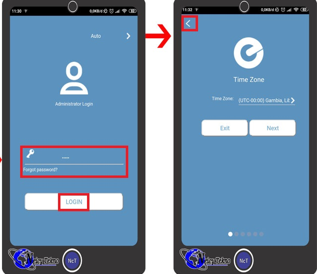
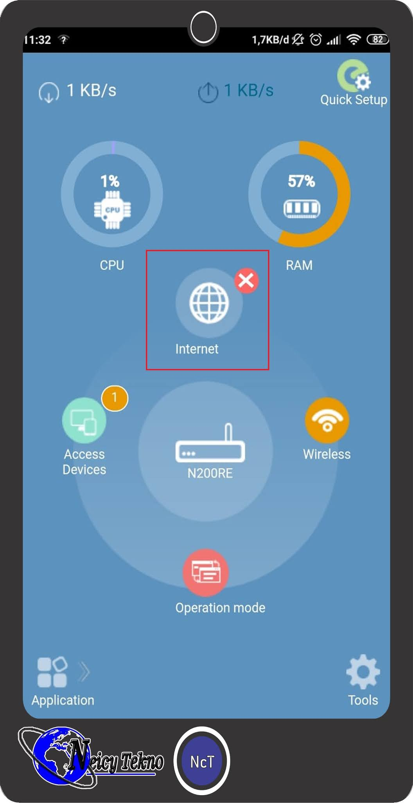
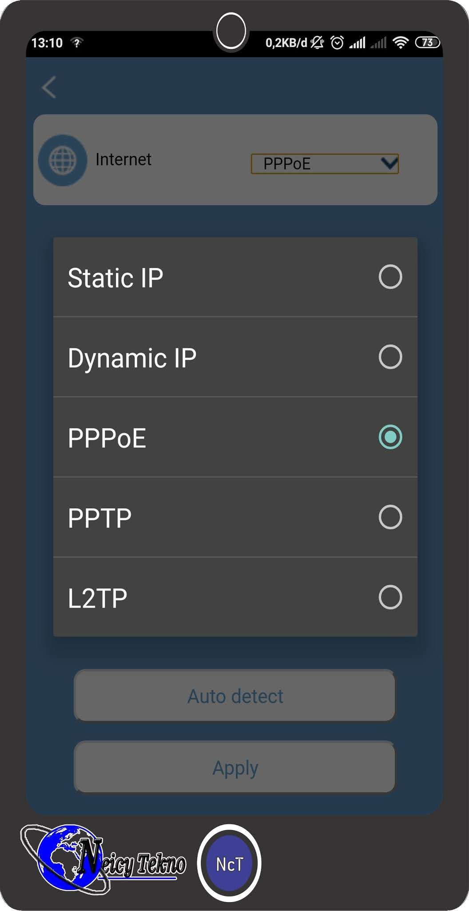
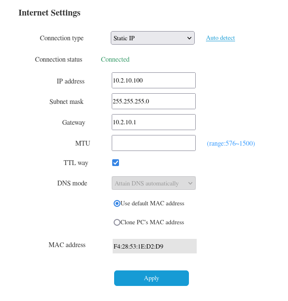

# Panduan Pengaturan Router Totolink N200RE: Mode PPPoE ke Mode IP Static

**Sebelum Memulai: Informasi Penting**

Sebelum memulai proses pengaturan, pastikan Anda memiliki informasi berikut:
- Alamat IP default router: 192.168.0.1 atau 192.168.1.1 (tergantung pada model)
- Password WiFi

    | Password Wifi                |
    |--------------------------|
    | 12345678  |
    | 87654321  |
    | 1234567890  |
    | 0987654321  |
    | 0123456789  |

- User/sandi router

    | Username                | Password          |
    |--------------------------|----------------|
    | admin  | admin          |
    | admin  | admin12345          |
    | admin  | admin123          |

- Manual : [Go Here](https://www.totolink.net/data/upload/20200429/01767fdfbb5be19a989a855dc757ef6b.pdf)

**Langkah 1: Memastikan Koneksi WiFi**

Pastikan perangkat HP Anda terhubung dengan jaringan WiFi yang disediakan oleh router Totolink N200RE. Buka peramban web pada HP Anda dan coba akses alamat IP default router. Jika Anda berhasil mengakses antarmuka router, masukan password router.

**Langkah 2: Navigasi ke Pengaturan Koneksi**

Cari menu atau opsi yang berkaitan dengan pengaturan koneksi internet atau pengaturan WAN. Anda mungkin akan menemukan bagian seperti "Internet Setup" atau "WAN Configuration".

**Langkah 3: Ubah Mode Koneksi**

Temukan opsi yang memungkinkan Anda mengubah mode koneksi dari PPPoE ke IP Static.

**Langkah 4: Isi Informasi IP Statis**

Setelah Anda mengubah mode koneksi, Anda akan diminta untuk mengisi informasi IP static. Isilah informasi berikut dengan benar:
- Alamat IP
- Subnet Mask
- Gateway
- DNS

Pastikan informasi ini sesuai dengan yang telah diberikan oleh penyedia layanan atau administrator jaringan.

**Langkah 5: Simpan Pengaturan**

Setelah Anda mengisi informasi IP static, jangan lupa untuk menyimpan pengaturan. Biasanya, Anda perlu mengklik tombol "Save" atau "Apply" untuk menerapkan perubahan.

**Langkah 6: Restart Router**

Setelah pengaturan disimpan, Anda mungkin perlu me-restart router agar perubahan berlaku.

**Langkah 7: Uji Koneksi**

Setelah router di-restart, uji koneksi internet Anda untuk memastikan bahwa pengaturan IP static berfungsi dengan baik.

